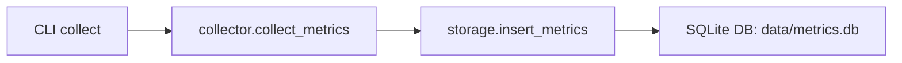
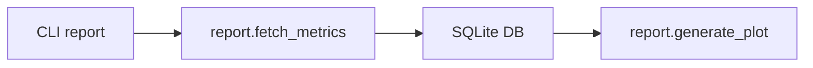

# Architecture du projet : System Monitor

## Objectif

Ce projet est un outil en ligne de commande qui permet de :
- Collecter des métriques système (CPU, RAM, processus) à intervalles réguliers
- Les enregistrer localement dans une base SQLite
- Générer des rapports visuels ou enregistrés à partir de ces données
- Filtrer les données selon des périodes temporelles

---

## Structure modulaire

Le projet est découpé en 4 modules principaux :

| Module       | Rôle principal                                         |
|--------------|--------------------------------------------------------|
| `collector`  | Récupère les métriques système en temps réel           |
| `storage`    | Gère la base de données SQLite pour stocker les métriques |
| `report`     | Génère des graphiques à partir des données stockées    |
| `cli`        | Interface en ligne de commande pour piloter l’outil    |

---

## Flux d'exécution (collecte)

---

## Flux d'exécution (rapport)

---

## Stockage des données

Les données sont enregistrées dans `data/metrics.db` au format SQLite, avec la table suivante :

| Champ           | Type    | Description                                   |
| --------------- | ------- | --------------------------------------------- |
| `id`            | INTEGER | ID auto-incrémenté                            |
| `timestamp`     | TEXT    | Date/heure de la collecte (ISO)               |
| `cpu`           | REAL    | Pourcentage d’utilisation du CPU              |
| `ram`           | REAL    | Pourcentage d’utilisation de la RAM           |
| `top_processes` | TEXT    | Liste JSON des N processus les plus gourmands |

---

## Options de la CLI

| Commande             | Description                                |
| -------------------- | ------------------------------------------ |
| `collect`            | Lance une session de collecte              |
| `show`               | Affiche les dernières métriques en console |
| `report`             | Génère un graphique (matplotlib)           |
| `--last` / `--since` | Permet de filtrer par période temporelle   |

---

## À venir

* Export CSV/JSON
* Alertes en temps réel
* Génération de rapport Markdown/PDF